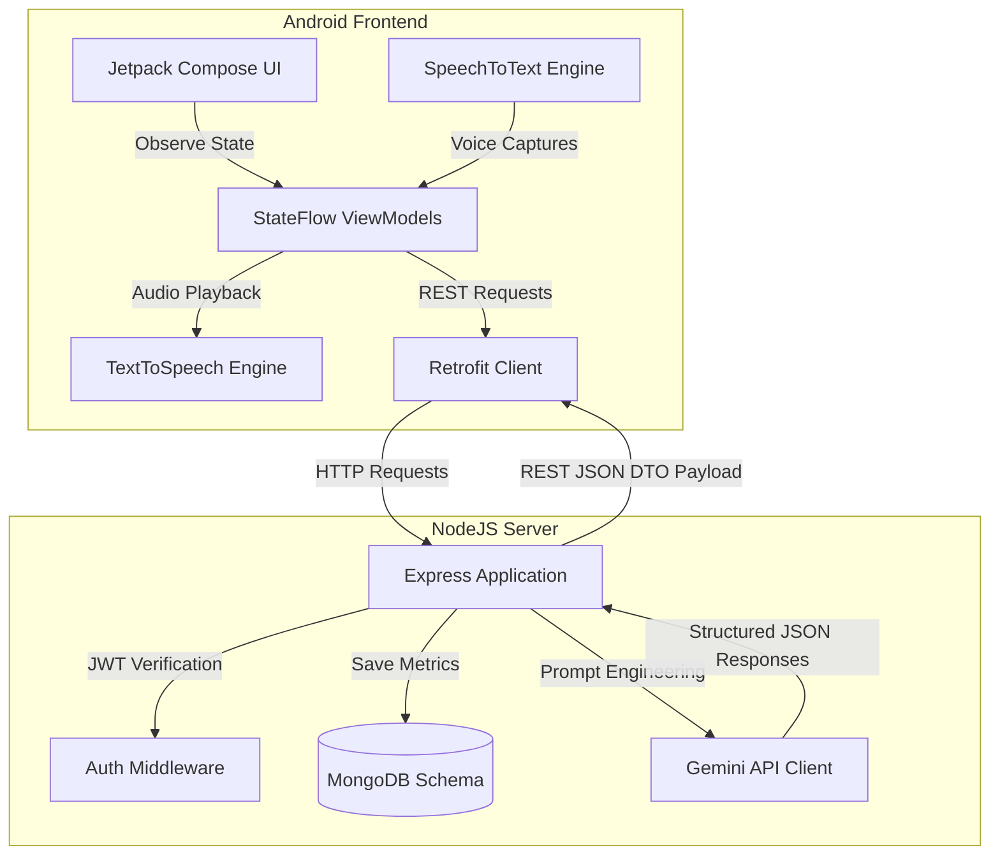

# InterviewAI 🎙️🤖

InterviewAI is a production-grade, full-stack Android application designed to help job seekers prepare for technical and HR engineering loops using generative artificial intelligence. 

The application conducts voice-based mock interviews, parses uploaded PDF resumes, generates tailored question sets, and evaluates candidate performance across multiple communication and technical dimensions using the **Google Gemini API**.

---

## 📸 Architectural Overview

The project is modularized into two primary subdirectories: `frontend/` (Native Jetpack Compose Android Client) and `backend/` (NodeJS Express API server).



---

## ✨ Features

*   **Secure Authentication (Phase 2)**: Secure user sign-up and log-in pages storing credentials inside MongoDB using bcrypt hashing. Sessions are cached locally via Jetpack DataStore preferences.
*   **Analytics Dashboard (Phase 3 & 4)**: Overview of overall readiness percentage, practice duration metrics, previous sessions histories, and a customized PDF resume picker.
*   **Resume Parsing & Questions Creator (Phase 5)**: Upload a resume to automatically extract programming expertise keywords (Kotlin, Hilt, Compose, etc.) and generate questions tailored to the candidate's target role, selected difficulty, and category.
*   **Active Voice Mock Session (Phase 6)**: Immersive practice screen with a glowing orbital visualizer pulsing dynamically matching speech states.
    *   **Text-to-Speech (TTS)**: The AI interviewer reads questions aloud.
    *   **Speech-to-Text (STT)**: The microphone listener converts candidate spoken answers into streaming transcripts in real-time.
*   **AI Performance Report (Phase 7)**: Aggregates performance scores across 4 key dimensions: *Technical Accuracy*, *Communication Clarity*, *Depth of Knowledge*, and *Confidence & Articulation*. Details exact strengths, weaknesses, and a custom action plan.
*   **Practice History & Profile (Phase 8)**: Dedicated history portal with real-time query search filters and custom target role configuration editors.

---

## 🛡️ Production-Grade Resiliency (Offline Bypass Mode)

To ensure the application never blocks the developer or user, we implemented robust dual-layer offline fallbacks:

1.  **Offline Database Bypass**: If the server fails to connect to MongoDB on startup, it automatically transitions to a fast **In-Memory Cache Database**. Auth registration, login, and report submissions will continue functioning seamlessly.
2.  **Offline API Client Fallback**: If the Android app cannot reach the server host address (e.g. connection timeout on physical USB devices), the viewmodel catches the network exception, prompts a warning banner (*"Server offline: Running in offline mock mode"*), and **automatically proceeds to the dashboard**, enabling full application testing offline.

---

## 🛠️ Tech Stack

### Frontend (Android)
*   **Kotlin** & **Jetpack Compose**: Modern declarative interface layers.
*   **Material 3**: Design system tokens for custom dark schemas.
*   **Navigation Compose**: Sealed string route transition controllers.
*   **DataStore Preferences**: JWT tokens and role configurations caching.
*   **Retrofit & OkHttp**: Networking client with JWT header injectors.

### Backend & AI
*   **Node.js** & **Express**: Lightweight HTTP server routing.
*   **MongoDB** & **Mongoose**: Relational collection database schemas.
*   **Google Gemini API**: Generative prompt models engineering.

---

## 🚀 Setup & Execution Guide

### 1. Run Backend Server
Ensure you have Node.js and MongoDB installed locally.

1.  Navigate into the backend directory:
    ```bash
    cd backend
    ```
2.  Install dependencies:
    ```bash
    npm install
    ```
3.  Configure your Gemini API Key in the `.env` configuration file:
    ```env
    GEMINI_API_KEY=AIzaSyD-your-copied-key-here
    ```
    *(If left blank, the server automatically defaults to high-fidelity mock AI responses).*
4.  Start the Node.js Express server:
    ```bash
    npm start
    ```
    The console will log: `InterviewAI Server launched on port 5000`.

### 2. Run Android App
1.  Open the `frontend` folder in **Android Studio**.
2.  Sync Gradle dependencies.
3.  Connect an Android device or launch an emulator (API 24+).
4.  Run the `app` configuration. The client communicates directly with the local host server via the standard emulator network bridge (`10.0.2.2:5000`).
